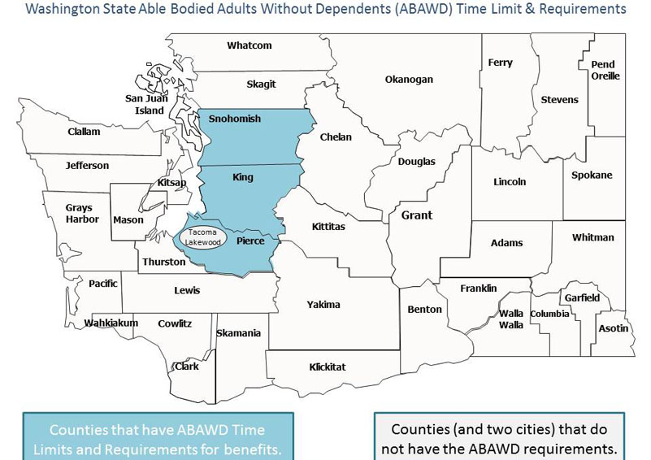
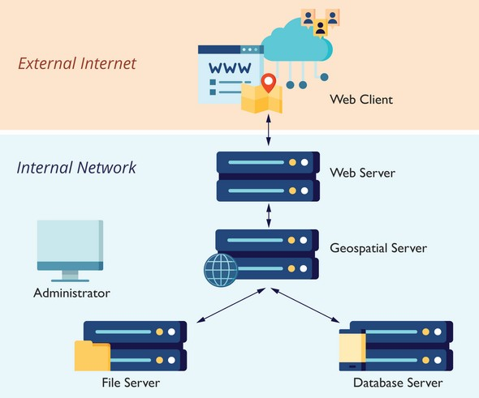

##Geog458 Advanced Digital Geographies
##Zhining Wang

###Introduction
The goal of the project is to provide a platform that allows users to search information about restaurants that operate during the pandemic in the Seattle area, allows the business owners to input new data and other related information into the database as well as stores and updates the data for other interactive uses. In addition, further goals of the project would be to help out people and restaurants that are in need (as well as other business if more data is available). What is more, I also think it is possible for the project to be developed into a mobile app that centers on covid time lifestyle or be integrated into bigger mobile services such as Google Map and Yelp to provide more accurate and up-to-date information. In the following paragraphs, I will talk about the audiences, data and reflection of the project and demonstrate the design and functions of the web map too.

###Audiences
The project is intended for anyone living in the Seattle area. More specifically, the user groups could be divided into two major types: ordinary users, or consumers, who want to look up restaurants, and business owners who want to input their data. In addition, this project could also be useful for people who take an interest in research about the covid.

###Data
According to the Seattle government, the data covers “restaurants, bars, cafes, and breweries in King, Pierce, and Snohomish counties” and is compiled from “publicly available sources and from self-reporting by business owners through a survey hosted by the City of Seattle, along with the he original dataset that is part of the City’s #SupportSeattleSmallBiz campaign, for restaurants, bars, cafes, and breweries that are doing delivery, to-go, and drive-through”.
The data was created on Oct 16, 2020 and last updated on Jan 1, 2021.
https://data.seattle.gov/dataset/Restaurants-Operating-during-COVID19/sg8s-8k6z

###Webmap
Major functions
-enable the input of restaurants data
-store the restaurants dataset
-visualize the dataset and provide data insight
-enable the search of restaurants and related information
-display the locations of restaurants on a dynamic map

Elements
-scalar bar: located at bottom left, display the scale in both metrics and miles
-zoom: located at bottom right, “+” represents zoom in and “-” represents zoom out
-legend: located rat bottom right, change with data selection(for example, in “u-district” map layer, all the locations are marked in green which will be specified in the legend)

Systematic architecture
-Web clients will access the project through the url (external network) from their own devices. All clients must be able to make web requests through HTTP, and any client coming from outside my network must have an Internet connection.
-Geospatial web servers that has specialized software and processing power for drawing maps, responding to feature queries, and performing GIS analysis operations will be used to host web services and provide an endpoint could be locally accessed from my device. A database (file server) that stores all the GIS data will also be required.
-Map services make maps, features, and attribute data available inside many types of client applications. The main map service used in the project is leaflet, an open JavaScript library designed for mobile-friendly interactive maps.
-flow: as mentioned above, clients access the web server from the external network through http. I downloaded the dataset to local server and constructed the web map with the geospatial server.  In other words, the interactions among the file / database server, the geospatial server and the web server are all employed on the same laptop.

Functions
The web map is implemented using web programing languages such as html, css and javascript. The fundamental framework is based on Bootstrap, a free and open-source CSS framework directed at responsive, mobile-first front-end web development that contains CSS- and JavaScript-based design templates for typography, forms, buttons, navigation, and other interface components.
The homepage includes title, modules of various thematic layers, info graphs and the database. On this page, the user can click on modules to access different thematic layers, customize info graphs (for example, the user can choose whether to show sum or mean of certain features), search in the whole database and input new data if the user is a business owner.
The map page includes a search bar and a responsive map. On this page, the user can search for restaurants in the search bar or just browse the restaurants which are currently stored in the database. The responsive map will react to the action of the user. The basemap is a Carto positron with labels. The map layer is created from the restaurants dataset whose features are implemented through leaflet. When a location on the map is moused over, a pop up window will appear and display the business name, address, phone number, website and other details of the restaurants.
The more info page includes some metadata about both the web map and the project. Descriptive metadata properties include title, project introduction, author, creation date and so on. Rights metadata might include copyright status, rights holder, or license terms. Technical metadata properties include file types, size, creation date and time, and data source. Technical metadata is often used for digital object management and interoperability.

###Critique of the UI Design
Because the website was built on an existing template from Bootstrap, I used some predefined layouts and designs and modified details while keeping the general framework. Overall, I think the website has a consistent color theme which also matches well with the visualization of the map. Only the modules of various thematic layers on the homepage are designed in a more colorful way to stand out more. With regard to the functionality, I think the database on the homepage is a bit confusing. It integrates the function of searching and also acts as a port for business owners to input information. In my opinion, both functions are most suitable for a database, but it is redundant to employ two databases on one website (even on different web pages of the same website). A modification could be made is to put the search options on the same page (second page ”map”) and employ a tab to switch between different options. In addition, another page could be created just for business owners where restaurants data could be input and other useful information could be displayed.

###Pros and Cons of the Examined Project
In my opinion, one advantage of the project is that it is in tune with the times. The pandemic is still ongoing, and this project may add some help to the corresponding services needed during the special time. Another good thing about the project is that the website is put together. It includes a few web pages with a basic structure and information architecture. On the other side, the project is not finished fully in many aspects. For example, the functions of the website are not implemented fully, including searching in the map and inputting new information into the database. What is more, the data was downloaded from the Seattle.gov website and uploaded from the local device, so it is not very flexible. The project requires up-to-dated information for the convenience of the users, so a connection needs to be built to transmit the data from the source. In addition, since business owners are encouraged to input new information into the database, the database should also have the abilities to store, update and sustain. In other words, there’s still a lot of work need to be done when it comes to data. Another disadvantage of the project is that some food /map mobile devices already have similar built-in functions (such as showing whether take out/dine in/drive through is available), so it is hard for the project to stand out in that sense.

###Reflection
As mentioned above, the project is concerned with the Covid. The pandemic has caused recession on the economy and difficulty on people’s ordinary life. The project is designed not only for consumers, but for business owners as well. An important purpose of the platform is to bring people together and help each other out during the special time. Besides the content mentioned previously, information about free food/food bank could also be added to help people in need in the future. From my perspective, geospatial information technology is a very useful technology to bring an idea to real life, which reminds me of the concept of technology being neutral, meaning that technology does not come with a value system that required its users to follow. This is not entirely true. As Robert J. Whelchel points out, technology “has a viewpoint…Because of technology's growing influence in society, the danger exists that this restricted manner of viewing reality could become accepted as the ``proper'' way to look at reality with the effect that other viewpoints would be attenuated or eliminated.” Technology is so closely related to the society as well as so much influence over it. Although my project is intended for the social good, it is import for me to pay attention to the narratives, visual elements, functions and so on and think about the social consequences these seemingly small details could cause.
