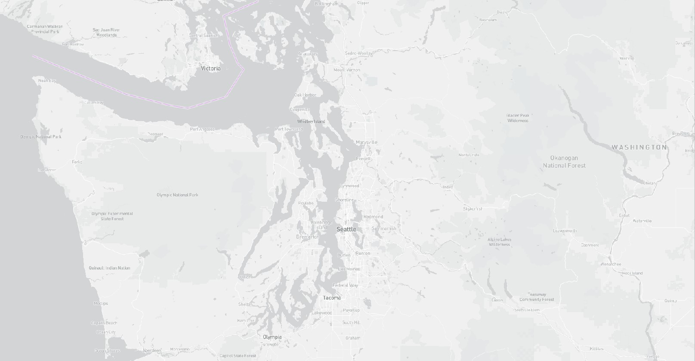
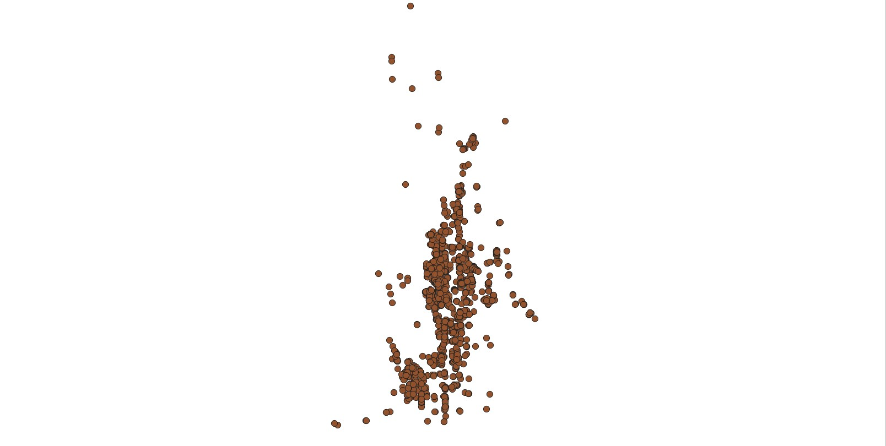
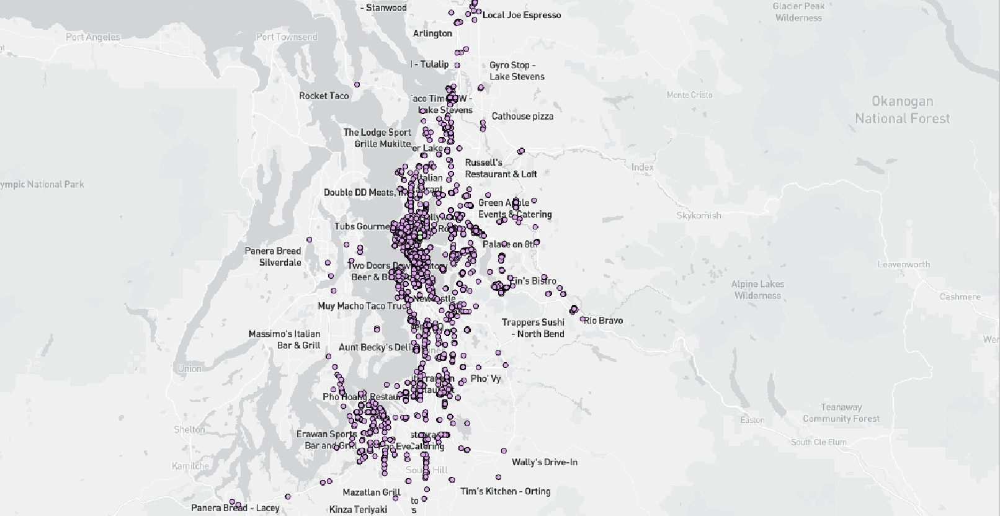

tile1 
 
area:Seattle 
zoom level: 0-5 
description: the tile set contains a layer of basemap in monochrome style

tile2 

area:Seattle
zoom level: 0-5
description: the tile set contains a layer of data of open restaurants during the covid in Seattle

tile3 
 
area:Seattle 
zoom level: 0-5 
description: the tile set contains both the basemap and the data layer.

tile4 

area:Seattle 
zoom level: 0-5 
description: the tile set contains maps with data visuliszation that displays restaurant names as well as marks out restaurants in the U-district in a different color.
